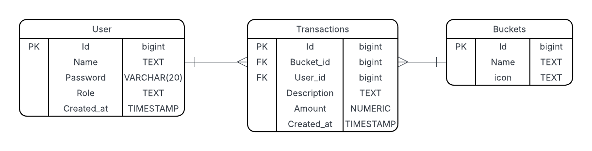

# Expense Tracker

## Project Overview
This is a personal side project built with **React + TypeScript** using **Vite** for the frontend, and an **ASP.NET Core 9.0 Web API** for the backend. For the database I make use of Postgres and Entity Framework Core 9.0 as the ORM.

The goal of this project is to strengthen my skills and gain more hands-on experience with these technologies.  

The application functions as an **expense tracker**, allowing users to record both expenses and income to better manage their finances.

## Entity Relationship Diagram

## Features
### Implemented Features:
- Add a transaction (expense or income) to a specific category.
- List all transactions in a specific category.
- List all transactions across all categories.

### Planned Features:
- Filter transactions by date or category.
- Authentication and authorization.
- Export a PDF report of transactions.

## How to run the project
### Database and API
1. Run: `dotnet restore or dotnet build`
2. Create the database: `dotnet ef database update`
3. Run the back-end: `dotnet run`

### Frontend
1. Run: `npm run dev`

